# FUZZTeam_fish - 钓鱼演练系统

对目标单位员工进行安全意识测试的钓鱼演练平台，支持管理目标、生成绑定目标的 EXE、接收回传数据。

## 快速开始 (本地运行)

```bash
# 安装依赖
pip install -r requirements.txt

# 启动服务 (Windows 会自动构建基础 EXE)
python run.py --host 0.0.0.0

# 浏览器访问输出的管理面板地址，默认账号密码:
# 用户名: fish
# 密码: fishfish@123
```

## Docker 部署 (Linux)

```bash
# 克隆仓库
git clone https://github.com/Herbert-555/FUZZTeam_fish.git
cd FUZZTeam_fish

# 部署
bash install_fish.sh

# 使用国内 pip 镜像加速
PIP_INDEX_URL=https://pypi.tuna.tsinghua.edu.cn/simple bash install_fish.sh

# 自定义端口
FUZZTEAM_FISH_MANAGE_PORT=8000 FUZZTEAM_FISH_LISTEN_PORT=9000 bash install_fish.sh

# 查看管理面板地址
docker logs fuzzteam-fish
```

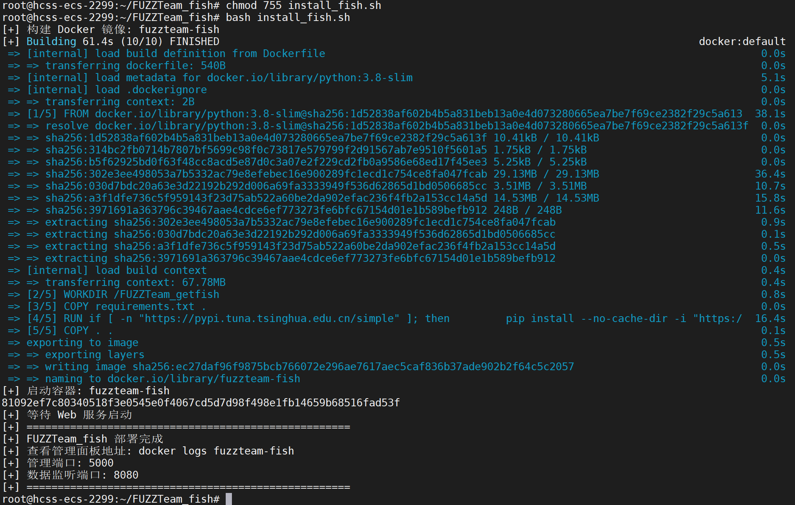

执行`docker logs fuzzteam-fish`获取访问地址

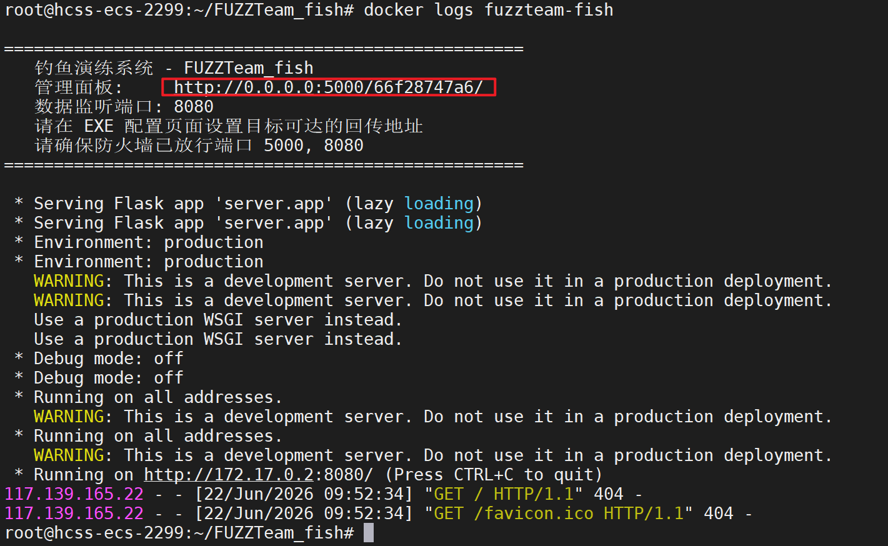

访问vps的`http://<ip>:5000/66f28747a6/`，就能访问管理端

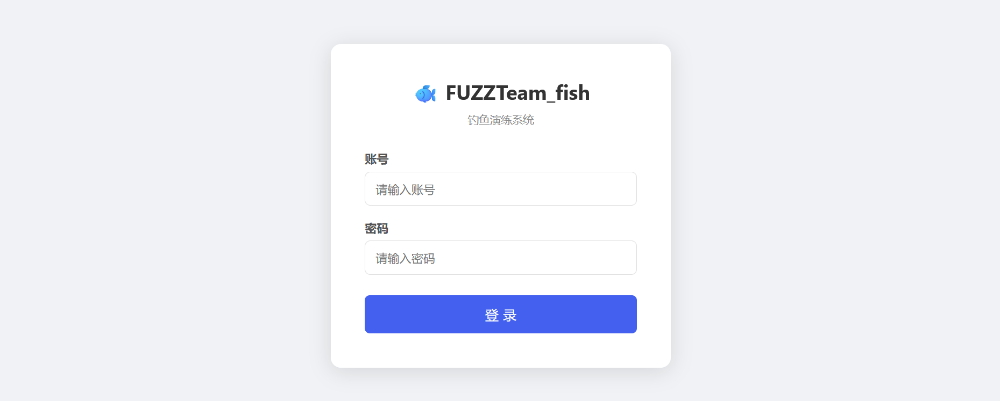

### 环境变量

| 变量                        | 默认值          | 说明             |
| --------------------------- | --------------- | ---------------- |
| `FUZZTEAM_FISH_CONTAINER`   | `fuzzteam-fish` | 容器名称         |
| `FUZZTEAM_FISH_IMAGE`       | `fuzzteam-fish` | 镜像名称         |
| `FUZZTEAM_FISH_MANAGE_PORT` | `5000`          | 管理面板端口     |
| `FUZZTEAM_FISH_LISTEN_PORT` | `8080`          | EXE 回传数据端口 |
| `FUZZTEAM_FISH_DATA`        | `./data`        | 数据库持久化目录 |
| `FUZZTEAM_FISH_UPLOADS`     | `./uploads`     | 截图上传目录     |
| `FUZZTEAM_FISH_OUTPUT`      | `./output`      | EXE 输出目录     |
| `PIP_INDEX_URL`             | 空              | pip 镜像源地址   |


## 系统使用

### 使用流程

1. 登录管理面板
2. 在「目标管理」中添加/批量导入目标
3. 在「EXE 配置」中设置图标、文件名模板、行为选项
4. 在「EXE 生成」中为基础 EXE 注入配置生成目标 EXE
5. 将生成的 EXE 分发给目标（通过邮件、U盘等）
6. 目标运行 EXE 后，在「采集数据」中查看回传的主机信息、截图、目录结构

使用`fish/fishfish@123`登录系统，到 **exe配置** 界面配置VPS的IP

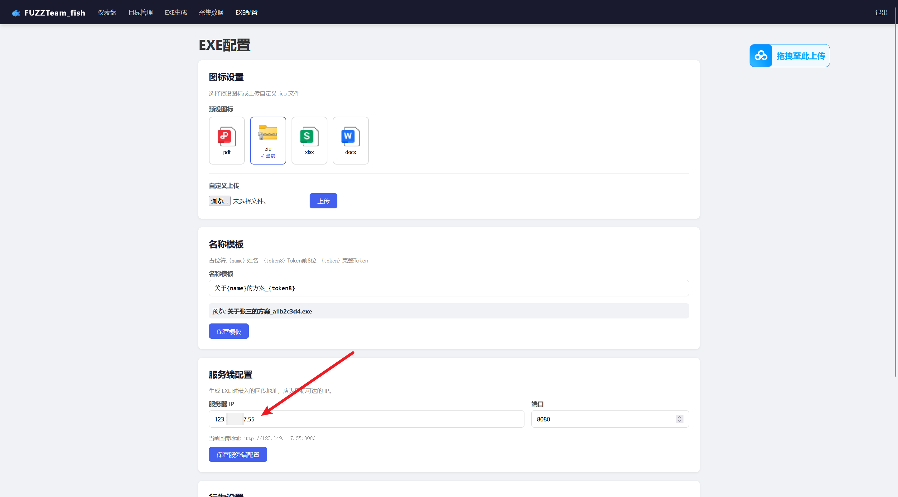

目标管理处添加目标

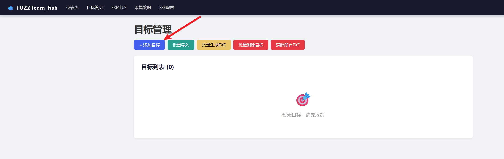

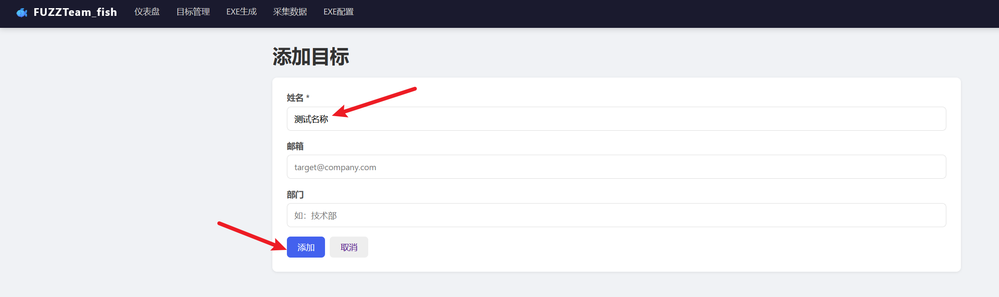

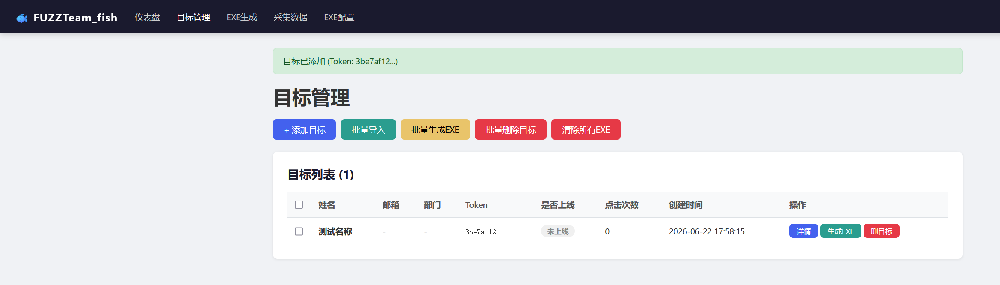

点击生成exe

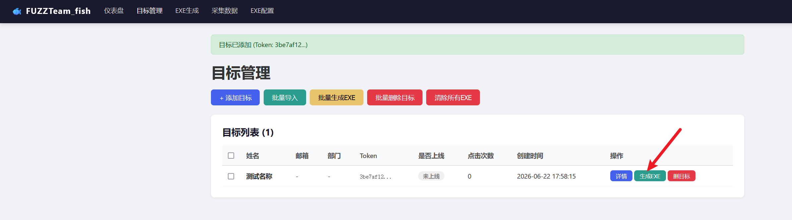

生成后下载

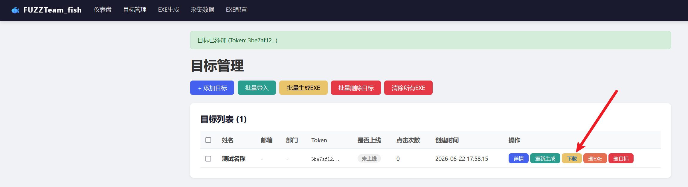

下载完成后放到目标机器进行执行

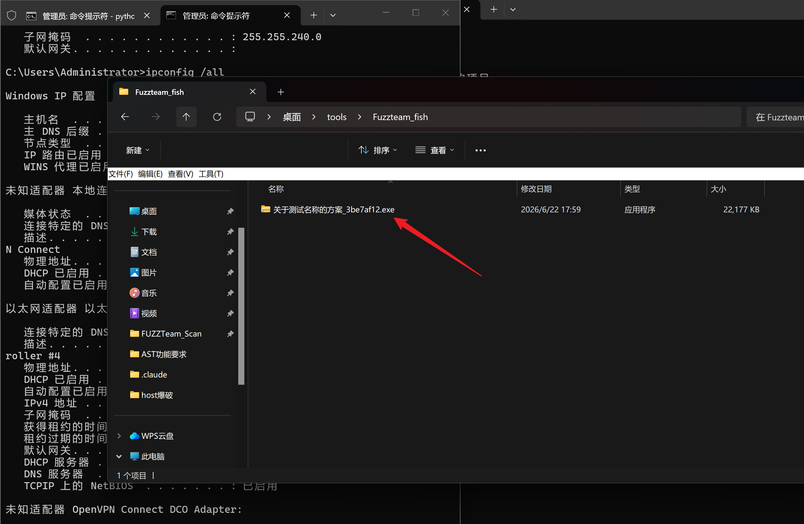

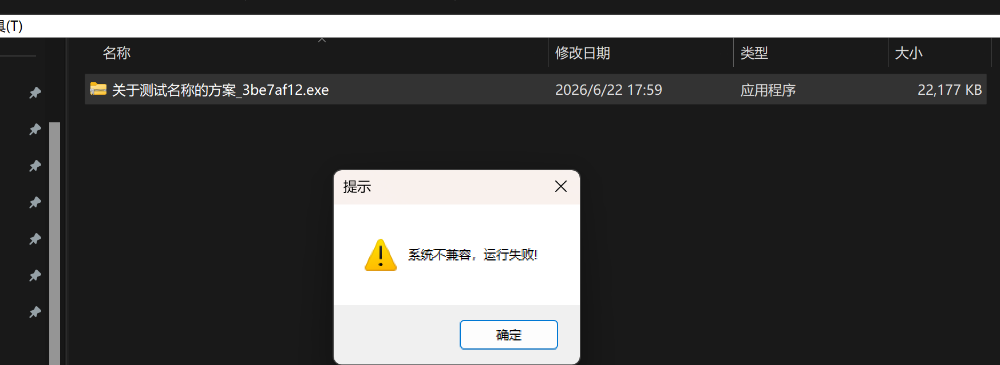

如果目标出网就可以获取回传信息

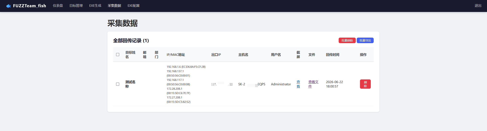

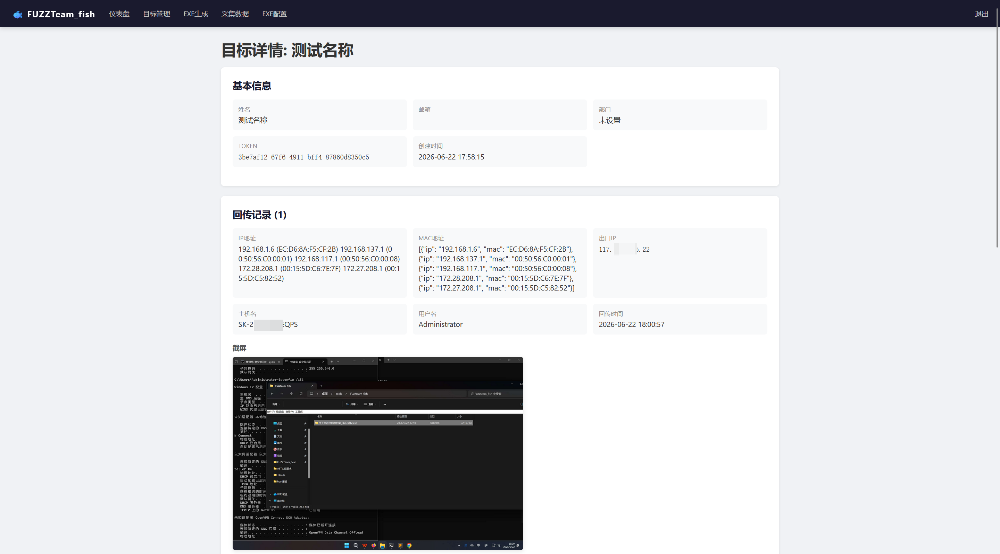

自动获取目标桌面、c盘、d盘文件名称大小信息

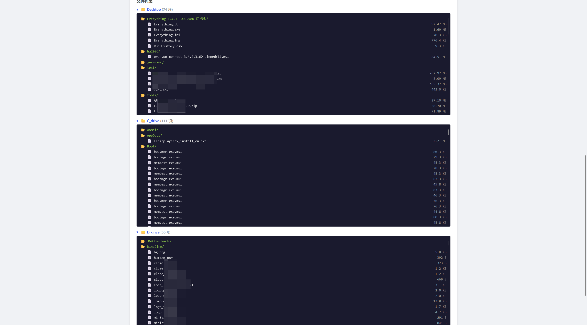


## 架构

```
run.py                    # 启动入口
server/                   # 服务端
├── app.py                # Flask 应用工厂
├── models.py             # SQLite 数据库模型
├── routes.py             # Web 路由 + API 端点
├── exe_builder.py        # EXE 生成 (footer 注入 / PyInstaller)
├── config_manager.py     # EXE 配置管理
├── icon_extractor.py     # 内置图标生成
└── templates/            # Jinja2 模板
client/
└── collector.py          # 客户端采集脚本 (被打包进 EXE)
```

## 技术要点

- **跨平台 EXE 生成**：Windows 上通过 PyInstaller 构建基础 EXE，Linux 上通过复制 + footer 注入生成目标 EXE，无需 Wine
- **配置加密**：EXE footer 中的配置使用 XOR 加密（密钥 `fishfish@aes`）
- **客户端功能**：采集主机信息、截屏、目录扫描、弹窗提示、自毁删除
- **默认账号**：`fish` / `fishfish@123`
